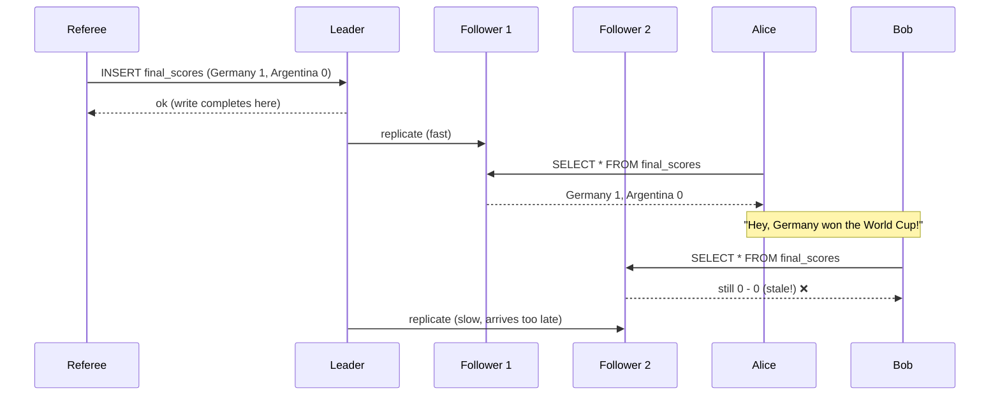
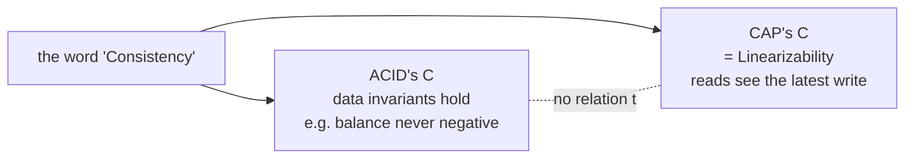
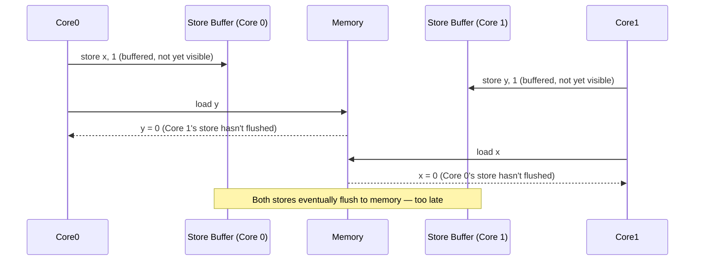
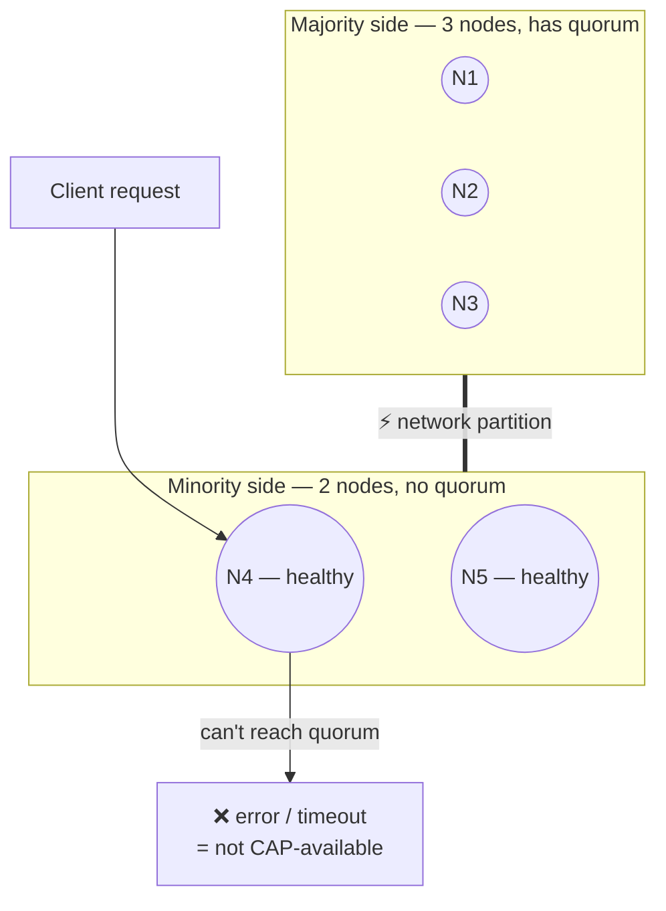
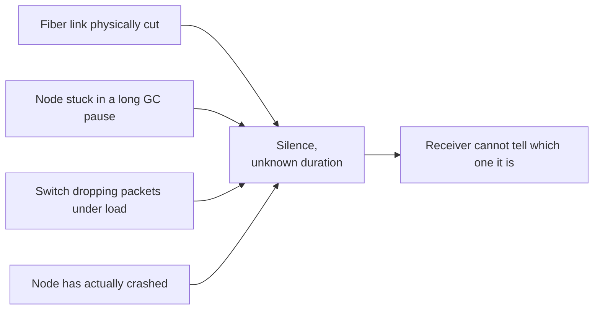
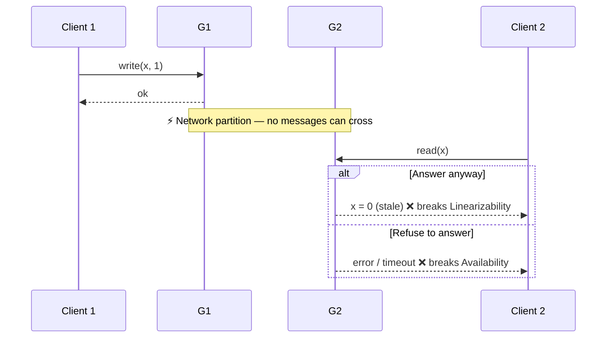
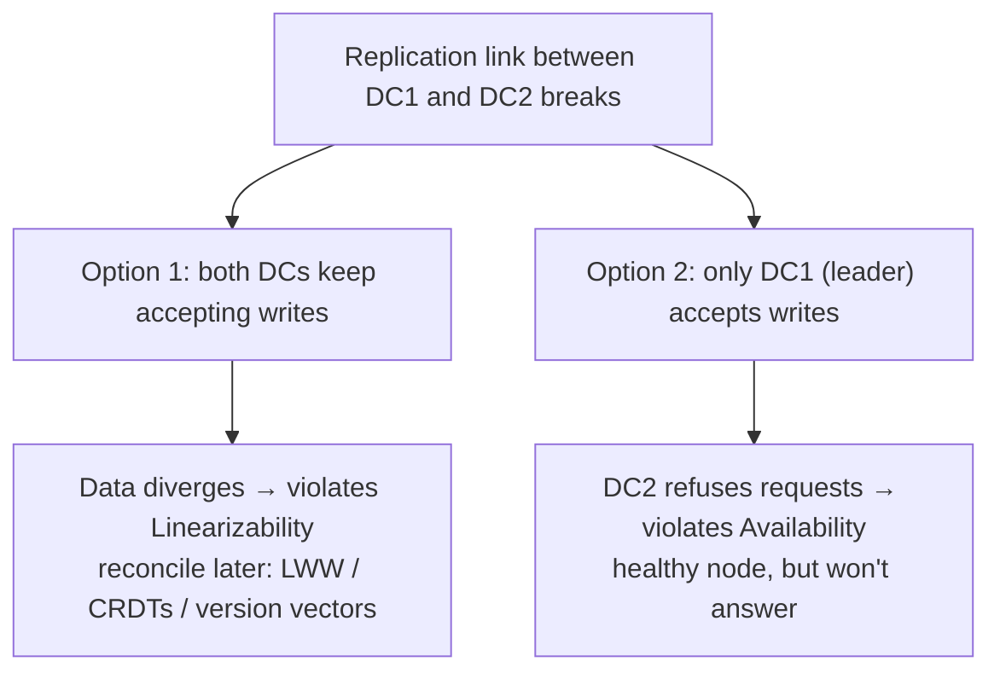

# The CAP Theorem, From First Principles

*Why "our database is AP" is usually a category error — and what's actually true underneath it.*

> This article is a first-principles walkthrough built on top of Martin Kleppmann's excellent 2015 post, [*Please stop calling databases CP or AP*](https://martin.kleppmann.com/2015/05/11/please-stop-calling-databases-cp-or-ap.html). If you want the original, denser, and more authoritative version, read that. This is the version I wish existed when I first read it — no assumed background, lots of concrete examples, nothing hand-waved.

---

## Why you can't use CAP casually

CAP is not a design philosophy or a marketing tagline. It's a mathematical proof, first stated informally by Eric Brewer and formally proven by [Gilbert & Lynch in 2002](https://www.comp.nus.edu.sg/~gilbert/pubs/BrewersConjecture-SigAct.pdf). A proof only holds for the exact objects it defines. The moment you substitute your own intuitive meaning for "consistent" or "available," you're no longer citing the theorem — you're citing something you made up and borrowing the theorem's authority for it.

So step one, before anything else, is: use the proof's own definitions.

- **Consistency** in CAP means *linearizability* — a specific, strong guarantee about recency. It has nothing to do with the C in ACID.
- **Availability** in CAP means *every non-failing node must answer every request it receives, without error*. Not "the system as a whole handles most traffic."
- **Partition tolerance** means the network can delay or drop messages arbitrarily. This isn't optional — it's just what real networks (the internet, your datacenter switches) actually do.

Let's take these apart one at a time.

---

## 1. Consistency = Linearizability (not ACID's "C")

**The definition, informally:** if operation B starts *after* operation A has finished, B must see a state at least as recent as the state A left behind.

The critical phrase is "starts after A finished" — this is about real, wall-clock time, not about some abstract logical ordering the database gets to choose.

### A worked example

- `t=0`: Client 1 writes `x = 5`. The write finishes at `t=1`.
- `t=2`: Client 2 reads `x` (strictly after the write finished).
- **Linearizability requires** Client 2 to see `5`. Seeing the old value `0` is a violation, full stop — the write was already done, in real time, before the read even began.

Now compare: if Client 2's read had started at `t=0.5` — *before* the write finished — then either `0` or `5` would be a legal answer. The two operations overlap in time, so there's no ordering fact to violate. Linearizability only constrains operations that don't overlap.

### The scenario that makes it click: Alice, Bob, and a football score

Kleppmann's example (from the yet-unreleased chapter of *Designing Data-Intensive Applications*) is the clearest way to see this. Picture the diagram: a Referee inserts the final World Cup score into a Leader database. The Leader acknowledges the write, *then* asynchronously replicates it to two followers — Follower 1 gets the update quickly, Follower 2 lags behind.

- Alice queries Follower 1 (already replicated) → sees `Germany 1, Argentina 0`. She turns to Bob and says it out loud.
- Bob, having *just heard Alice say it*, queries Follower 2 — but the replication message hasn't arrived there yet. He sees the game as still in progress.



Bob's query started *after* Alice's finished — so it should have seen at least what she saw. It saw less. That gap between the two `replicate` arrows arriving at different times is the entire bug.

Formally: Bob's read started strictly after Alice's read completed (we know this because Bob's own action — asking, then querying — happened in response to hearing her). So Bob's read must return a state at least as new as what Alice saw. It doesn't. **That's the violation.**

Notice what made this provable: Alice and Bob talked to each other. The database has no way of knowing about that side-channel. This is the crux of why linearizability is expensive to provide — a database can't ask "do these two clients happen to know each other?" It has to guarantee ordering **for every possible side-channel it doesn't know about**, which means, practically, it has to behave as though there's only one copy of the data, even when there are many replicas underneath.

### Why this is *not* ACID's "C"



ACID consistency is about invariants over your data — e.g., "an account balance is never negative," or "every order has a matching customer row." It's enforced by transactions and has nothing to say about *recency*.

Linearizability says nothing about invariants. It's purely about whether a read sees the latest write, in real time, for a single object. A database can be perfectly ACID-consistent (never violates a foreign key) while serving stale reads from a lagging replica (not linearizable) — and vice versa. These are two unrelated properties that happen to share the word "consistency."

### It's not even free inside a single CPU

This isn't a database-specific quirk — it shows up any time you have multiple copies of state and asynchronous propagation between them, at *any* layer of a system. Modern CPUs use per-core store buffers: a `store x, 1` on core 0 can sit in that core's buffer, invisible to core 1, for a short window. Classic example:

```
Initially: x = 0, y = 0

Core 0:            Core 1:
store x, 1         store y, 1
load  r1, y        load  r2, x
```



On a truly linearizable machine, `r1 == 0 && r2 == 0` should be impossible — one store must precede the other's load. On real x86/ARM hardware, without an explicit memory barrier (`mfence`, `dmb`), this outcome is observed in practice. The fix is structurally identical to the database fix: force the "replica" (the other core's cache) to catch up before a dependent operation is allowed to proceed. Same problem, same solution, completely different hardware layer.

---

## 2. Availability = *every* non-failing node, not *some* node

**The definition:** every request that reaches a non-failing node must produce a non-error response. Not "the cluster, taken as a whole, answers most requests." Every non-failing node, individually.

### A worked example

Take a 5-node Raft cluster. A network partition splits it 3-2. The minority side has a node, call it `N4`, that is completely healthy — CPU fine, disk fine, process running. But it can't reach a quorum, so per the protocol it refuses writes (returns an error or times out).



`N4` has not crashed. It received a request. It returned an error. By CAP's definition, **this system is not available**, full stop — regardless of how well the majority side is doing.

### Why "high availability" in marketing usually isn't this

"Our API had 99.99% uptime last quarter" is an *aggregate*, measured against traffic that a load balancer already routed to healthy nodes. If the load balancer simply stops sending requests to `N4` during the partition, that doesn't fix the CAP-availability violation — it just hides it, because `N4` never gets asked. CAP's definition is deliberately adversarial: it asks whether *every individual node* can answer if asked, not whether your routing layer is clever enough to avoid asking the wrong one.

### Availability also says nothing about speed

CAP's availability only requires a non-error response *in finite time* — there's no upper bound. A system that takes 90 seconds to respond during a network hiccup, but eventually returns a correct answer, is technically "CAP-available." A user staring at a spinner for 90 seconds will not agree that the system was "available." This gap — CAP's total silence on latency — is exactly what motivated Daniel Abadi's extension, **PACELC**: *if Partitioned, choose Availability or Consistency; Else, choose Latency or Consistency.* The "Else" branch captures a tradeoff that exists **even when the network is perfectly healthy**, which CAP has nothing to say about.

---

## 3. Partition tolerance = the network is asynchronous (you don't get a choice)

**The definition:** the network can delay, drop, or reorder messages arbitrarily, and a node cannot reliably distinguish "the message is late," "the message is lost," and "the other node has crashed."

This isn't a feature you opt into. It's an honest description of TCP/IP over the internet or across datacenters. Consider four scenarios, all indistinguishable from the receiving node's point of view:

- A cross-region fiber link is physically cut for 90 seconds.
- A node hits a long garbage-collection pause and can't respond for several seconds.
- A switch drops packets under load, triggering TCP retransmits and latency spikes.
- A node has genuinely crashed and will never respond again.



From the outside, all four look identical: *silence, for an unknown duration*. There is no timeout value that reliably tells these apart — this ambiguity is a fundamental fact about asynchronous networks (related to the [FLP impossibility result](http://cs-www.cs.yale.edu/homes/aspnes/pinewiki/FLP.html)), not an engineering gap waiting to be closed. So "tolerating partitions" isn't a design decision — it's an acknowledgment of reality.

---

## The proof, compressed to five lines

Two nodes, `G1` and `G2`, sit on opposite sides of a partition — no messages can cross.

1. A client writes `x = 1` to `G1`. It completes.
2. Later (in real time), a different client reads `x` from `G2`.
3. `G2` has not heard about the write — it can't have, the partition blocks every message.
4. `G2` now has exactly two moves:
   - Answer with its stale local value → **violates linearizability** (the read started after the write completed, but returned an older state).
   - Refuse to answer until it can confirm with `G1` → **violates availability** (a non-failing node failed to give a non-error response).
5. There is no third option, because the network genuinely will not deliver the message during the partition.



That's the whole theorem. Two datacenters make this concrete: DC1 and DC2 replicate a database between them; the replication link goes down. Either both datacenters keep accepting writes and diverge (giving up linearizability — this is exactly the multi-leader conflict problem, resolved via last-writer-wins, CRDTs, or Dynamo-style version vectors), or the non-leader datacenter stops answering requests entirely until the link heals (giving up availability). CAP's proof gives you no third option, and the two-datacenter picture makes it obvious why: it's the abstract `G1`/`G2` argument, just with a physical shape.



One subtlety worth sitting with: choosing "unavailable" for the minority side doesn't necessarily mean an outage for your users. If a load balancer detects the partition and reroutes *all* traffic — including the minority datacenter's own users — to the majority side, the application can stay fully up with zero perceived downtime, even though, strictly by CAP's definition, one datacenter's database was "unavailable" the entire time. CAP-availability is a per-node correctness property; the availability your users and your SLA actually care about is an aggregate, latency-bounded, business-level metric. The two frequently disagree.

---

## What CAP does *not* cover (and this is most of what actually matters)

CAP's proof is precise, and that precision comes at the cost of scope. Three specific restrictions:

**1. It's about a single register — nothing more.** The proof's entire universe is one key holding one value, with `read()` and `write()`. A transaction touching two objects (e.g., transferring money between `balance[A]` and `balance[B]`) is simply outside the theorem. CAP says nothing about it — not whether it's possible, not what the tradeoffs are. That question needs entirely separate machinery (two-phase commit, distributed transaction protocols), with its own definitions of consistency built from scratch.

**2. The only fault it models is a network partition.** Nodes never crash, disks never fill up, software never has bugs — in CAP's world, the *only* thing that goes wrong is messages between healthy nodes getting delayed or dropped. A node getting OOM-killed, a disk hitting `ENOSPC`, a replication bug silently corrupting data, a compromised node returning garbage (Byzantine faults) — none of these are covered. Building on CAP alone as your fault model means you've reasoned about one axis of failure and skipped the rest.

**3. It says nothing about latency.** As noted above, a system that takes two minutes to respond during a network blip is, mathematically, "CAP-available." Most real outages and most user complaints are about *slow*, not *erroring* — and CAP is structurally incapable of describing that distinction.

---

## Putting it together

CAP is a genuinely useful, genuinely precise result — about one register, one fault type, and a binary error/non-error outcome. That narrowness is *why the proof is valid*. But it also means that when someone says "our database is AP" as a blanket description of its behavior, they're usually smuggling in claims the theorem was never built to make: claims about multi-object transactions, about crash and disk faults, about latency under normal operation. All of that lives outside CAP entirely, and needs its own reasoning.

The honest, useful question is never "is this system CP or AP?" It's: *what does this specific system do, to this specific piece of data, during this specific kind of partition* — and separately, what does it do about node crashes, disk failures, and latency, none of which CAP will help you with. That's a much longer conversation, but it's the conversation that actually matters when you're picking or building a distributed system.

---

### Further reading

- Martin Kleppmann, [*Please stop calling databases CP or AP*](https://martin.kleppmann.com/2015/05/11/please-stop-calling-databases-cp-or-ap.html) — the source for this article.
- Gilbert & Lynch, [*Brewer's Conjecture and the Feasibility of Consistent, Available, Partition-Tolerant Web Services*](https://www.comp.nus.edu.sg/~gilbert/pubs/BrewersConjecture-SigAct.pdf) — the formal proof.
- Herlihy & Wing, [*Linearizability: A Correctness Condition for Concurrent Objects*](http://cs.brown.edu/~mph/HerlihyW90/p463-herlihy.pdf) — the formal definition CAP's "C" borrows.
- Kyle Kingsbury (aphyr), [*The Network is Reliable*](https://aphyr.com/posts/288-the-network-is-reliable) — real-world evidence that partitions genuinely happen.
- Daniel Abadi, [*Problems with CAP, and Yahoo's little known NoSQL system*](http://dbmsmusings.blogspot.co.uk/2010/04/problems-with-cap-and-yahoos-little.html) — the paper introducing PACELC.
